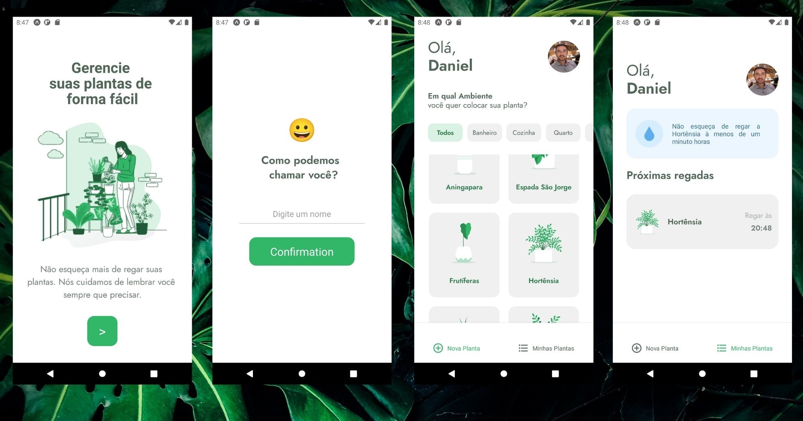

<div align="center" id="top"> 
  

&#xa0;

</div>

<h1 align="center">WePlant App</h1>

<p align="center">
  

  

  

  

  <!--  -->

  

  <!--  -->
</p>

<h4 align="center"> 
	🚧  WePlant - Under construction...  🚧
</h4> 

<hr>

<p align="center">
  <a href="#about">About</a> &#xa0; | &#xa0; 
  <a href="#features">Features</a> &#xa0; | &#xa0;
  <a href="#technologies">Technologies</a> &#xa0; | &#xa0;
  <a href="#requirements">Requirements</a> &#xa0; | &#xa0;
  <a href="#starting">Starting</a> &#xa0; | &#xa0;
  <a href="#license">License</a> &#xa0; | &#xa0;
  <a href="https://github.com/danielbcarvalho" target="_blank">Author</a>
</p>

<br>

## About

A React-Native app to help manage the cultivation of home plants. You can add plants you want to care of and see watering details and other information. The application will manage your plants and send notifications to take care of them.

Developed during the 'Next Level Week #5' from [Rocketseat](https://rocketseat.com.br/).

## Features

* Home screen with personal data;
* Select plants from an Api;
* See plants details;
* Add / Remove plants from the list;
* Persisting data across page reloads using AsyncStorage;
* Showing notifications using Expo Notifications Api;

## Technologies

The following tools were used in this project:

- [React Native](https://reactnative.dev/)
- [Expo](https://expo.io/)
- [TypeScript](https://www.typescriptlang.org/)
- [Json-Server](https://github.com/typicode/json-server)
- [React Navigation](https://reactnavigation.org/)

## Requirements

Before starting, you need to have [React Native](https://reactnative.dev/docs/environment-setup) and [Expo](https://docs.expo.io/get-started/installation/) installed.

## Starting

```bash
# Clone this project
$ git clone https://github.com/danielbcarvalho/weplant.git

# Access
$ cd weplant

# Install dependencies
$ yarn 

# Run the project
$ expo start

# The server will initialize in the <http://localhost:3000>
```

## License

This project is under license from MIT. For more details, see the [LICENSE](LICENSE.md) file.


Made by <a href="https://github.com/danielbcarvalho" target="_blank">Daniel Carvalho</a>

[](https://www.linkedin.com/in/danielcarvalho-dev/)


&#xa0;

<a href="#top">Back to top</a>
